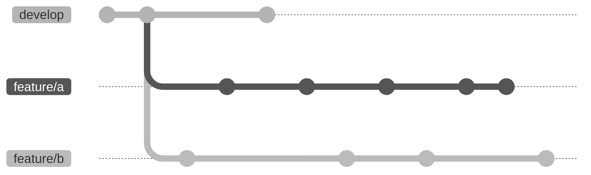
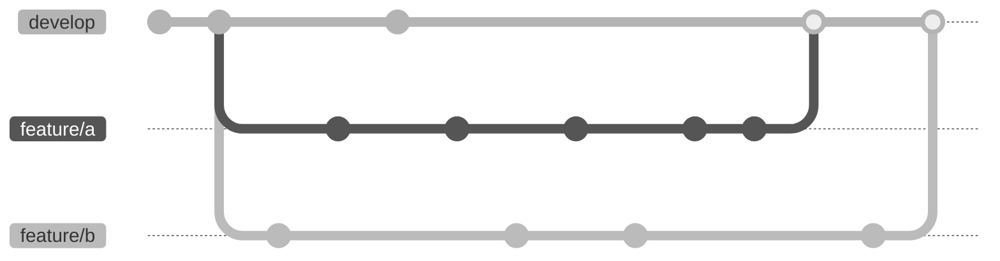
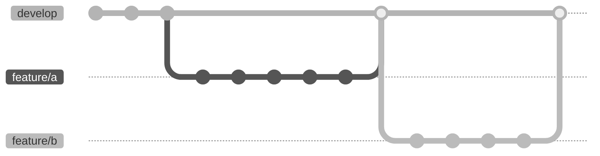

# Contributing
The following is a set of guidelines for contributing to SAMPLE on GitHub.
These are mostly guidelines, not rules. So, use your best judgment.

#### Table Of Contents

[Git](#git)
 * [Commit frequency vs size](#commit-frequency-vs-size)
 * [Feature branches](#feature-branches)
 * [Binary files](#binary-files)
 * [Interactive notebook files](#interactive-notebook-files)

[Tests](#tests)
 * [Unit Tests](#unit-tests)
 * [Coverage](#coverage)

[Docs](#docs)
 * [Docstring style](#docstring-style)
 * [GitHub Pages](#github-pages)

[Styleguides](#styleguides)
 * [Code style](#code-style)
 * [Code format](#code-format)

## Git
We are using
[`git-flow`](https://nvie.com/posts/a-successful-git-branching-model/)
branching model. Consider using automated tools to manage your branches

### Commit frequency vs size
When possible, prefer a big number of small (self-contained) commits over a
small number of big commits. This usually helps the other contributors in
understanding what you are have done.

### Feature branches
Merged feature branches should not overlap.
To avoid this, consider rebasing your feature branch with respect to `develop`
before merging, or use `git flow feature rebase` if you are using `git-flow`
automated tools.

This is ok, because branches have not been merged yet


This is not ok, because branches overlap


This is ok, because branches have been correctly rebased


### Binary files
As a general rule, avoid versioning binary files directly using git.

### Interactive notebook files
When committing changes to `.ipynb` files, be careful **not** to include
notebook outputs. They should not be included because
 - they are redundant, because they can be generated by running the notebook
 - they can be large (possibly binary) files, that increase the repository size
   unnecessarily

To avoid committing notebook outputs, you can clear all outputs from your
Jupyter servers GUI menu before saving the file.

Also, avoid committing variable values that depend on your systems state
(e.g. data paths, python version metadata, cell execution counts etc...).
To  better control what you are committing,
consider adding changes to `.ipynb` files  using the `--patch` option
```
git add --patch <path/to/notebook.ipynb>
```

## Tests
Your code should pass all unit tests before it is merged onto `develop`.
Install the Python packages required to run unit tests specified in [`requirements.txt`](requirements.txt).

### Unit Tests
To perform unit tests, run this command from the repository root directory
```
python -m unittest -v
```

### Coverage
Coverage settings are in the [`.coveragerc`](.coveragerc) file.
To evaluate test coverage, run this commands from the repository root directory
```
coverage run
coverage combine
```

You can output human-readable reports with
```
coverage html
coverage xml
coverage json
```

## Docs
Documentation is generated from docstrings with `sphinx`.
Install the Python packages required to make documentation specified in [`requirements.txt`](requirements.txt).

Build the HTML documentation running this command in the
[`docs`](docs) directory
```
make clean
make html
```

### Docstring style
We are adopting [Google Style Python Docstrings](
https://sphinxcontrib-napoleon.readthedocs.io/en/latest/example_google.html
)

### GitHub Pages
Documentation is automatically built at new version,
and published on [GitHub Pages](https://limunimi.github.io/SAMPLE)

## Styleguides
Install the Python packages required to automate style check and formatting specified in [`requirements.txt`](requirements.txt).

### Code style
Check your code style with `pylint`.
We are using the `pylintrc` from
[Google Python Style Guide](https://google.github.io/styleguide) 

To check your code style, run this command from the repository root directory
```
pylint -r y --exit-zero --jobs 1 --persistent=n --rcfile=pylintrc sample tests ./*.py
```

To update the `pylintrc` file, download it from Google's repository
```
wget https://google.github.io/styleguide/pylintrc -O pylintrc
```

### Code format
Format your code with the yapf auto-formatter.
Format rules are in the [`.style.yapf`](.style.yapf) file.
As for [code style](#code-style), we are using Google's style.
To reformat the codebase, run this command from the repository root directory
```
yapf -ir sample tests ./*.py
```
